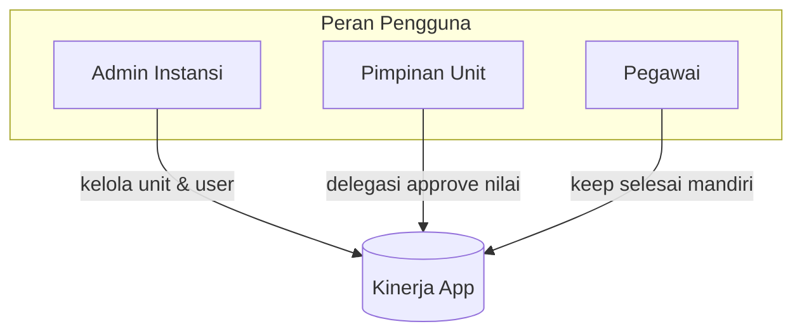
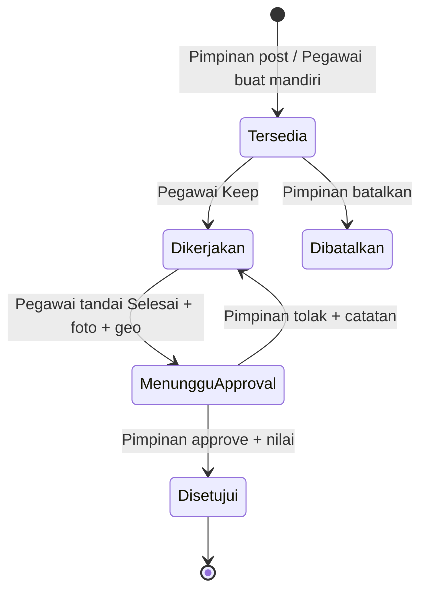
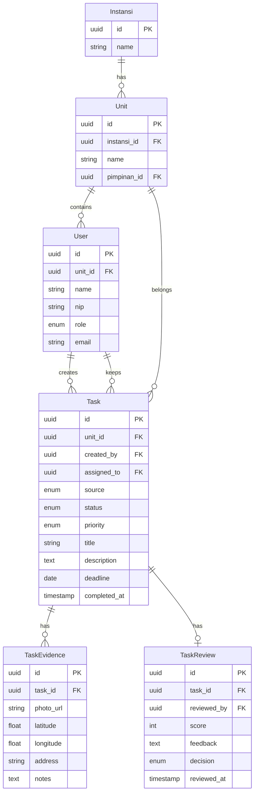

# PRD: Aplikasi Kinerja ASN (Kinerja)

## 1. Ringkasan Produk

**Nama:** Kinerja  
**Visi:** Memudahkan pimpinan mendelegasikan tugas harian dan memudahkan pegawai melaporkan capaian — sederhana seperti post-it, powerful untuk arsip kinerja bulanan.  
**Platform:** Web app mobile-first (PWA), Next.js + PostgreSQL  
**Cakupan:** Multi unit/bidang dalam satu instansi

---

## 2. Masalah yang Diselesaikan

| Masalah | Solusi |
|---------|--------|
| Delegasi tugas tidak terstruktur (chat/WA) | Menu Pimpinan: posting tugas ke board unit |
| Sulit melacak siapa mengerjakan apa | Fitur **Keep** — pegawai klaim tugas secara eksplisit |
| Bukti kerja tidak terdokumentasi | Foto + geo-tag saat selesai |
| Penilaian kinerja tidak transparan | Approval + nilai oleh pimpinan |
| Pegawai menunggu tugas dari atas | Tugas mandiri pegawai (self-initiated) |
| Arsip kinerja bulanan manual | Dashboard bulanan + printout PDF |

---

## 3. Persona & Peran



| Peran | Hak Akses |
|-------|-----------|
| **Admin Instansi** | CRUD unit/bidang, assign user ke unit, assign pimpinan per unit |
| **Pimpinan** | Post tugas ke unit, approve & beri nilai, lihat laporan unit |
| **Pegawai** | Keep tugas, update selesai, buat tugas mandiri, lihat laporan pribadi |

**Catatan scope:** Satu pegawai terikat ke satu unit. Pimpinan hanya melihat/mengelola unit yang dipimpinnya.

---

## 4. Alur Utama (User Flow)



### 4.1 Alur Pimpinan — Delegasi Tugas
1. Login → Menu **Pimpinan**
2. Tap **+ Tugas Baru** → isi: judul, deskripsi singkat, deadline (opsional), prioritas (rendah/sedang/tinggi)
3. Tugas muncul di **Board Post-it** unit sebagai kartu warna-warni (status: *Tersedia*)
4. Notifikasi push/in-app ke pegawai unit (opsional fase 2)

### 4.2 Alur Pegawai — Keep & Selesai
1. Buka **Board Tugas** → lihat post-it *Tersedia* (warna kuning) dan *Mandiri* (warna biru)
2. Tap **Keep** pada tugas → status *Dikerjakan* (post-it berpindah ke kolom "Saya")
3. Saat selesai → tap **Telah Selesai**:
   - Wajib: catatan singkat hasil
   - Wajib: **ambil foto** (kamera/galeri)
   - Wajib: **geo-tag** otomatis (GPS) + opsi override alamat manual
4. Status → *Menunggu Approval*

### 4.3 Alur Pimpinan — Approve & Nilai
1. Menu **Persetujuan** → daftar tugas selesai menunggu review
2. Buka detail → lihat foto, lokasi (peta mini), catatan pegawai
3. Aksi: **Setujui + Nilai (1–100)** atau **Tolak + Catatan revisi**
4. Tugas disetujui masuk arsip kinerja bulanan

### 4.4 Alur Pegawai — Tugas Mandiri
1. Tap **+ Tugas Mandiri** → isi judul, deskripsi, estimasi
2. Langsung status *Dikerjakan* (tanpa perlu Keep)
3. Alur selesai & approval sama dengan tugas delegasi

---

## 5. Fitur Detail

### 5.1 Board Post-it (Halaman Utama)

Desain sederhana, 3 kolom swipeable di mobile:

| Kolom | Isi | Warna Post-it |
|-------|-----|---------------|
| **Tersedia** | Tugas belum di-keep | Kuning `#FFF9C4` |
| **Dikerjakan** | Tugas saya (keep/mandiri) | Oranye `#FFE0B2` |
| **Selesai** | Menunggu/disahkan | Hijau `#C8E6C9` |

**Elemen kartu post-it:**
- Judul (max 60 karakter, bold)
- Badge: prioritas / mandiri / delegasi
- Deadline (jika ada)
- Avatar pegawai (jika sudah di-keep)
- Tap → detail drawer/modal

**Interaksi mobile:**
- Swipe horizontal antar kolom
- Long-press untuk quick action (keep/selesai)
- Pull-to-refresh

### 5.2 Menu Pimpinan

Sub-menu:
- **Board Unit** — lihat semua post-it unit (read-only untuk tugas orang lain)
- **Delegasi Tugas** — form buat tugas baru
- **Persetujuan** — badge counter tugas pending
- **Laporan Unit** — ringkasan bulanan unit

### 5.3 Foto & Geo-tagging

| Field | Aturan |
|-------|--------|
| Foto | Min 1, max 3 foto per penyelesaian; compress client-side (max 1MB/foto) |
| Geo-tag | Auto-capture lat/lng via browser Geolocation API; fallback input alamat |
| Peta | Leaflet/OpenStreetMap — pin lokasi read-only di detail tugas |
| Storage | Upload ke S3-compatible / local storage via Next.js API |

**Privacy note:** Pegawai diminta izin lokasi saat pertama kali; jika ditolak, wajib isi alamat manual.

### 5.4 Laporan Bulanan & Printout

**Dashboard Bulanan** (Pegawai & Pimpinan):
- Filter: bulan/tahun, unit (pimpinan), pegawai (pimpinan)
- KPI cards: total tugas, selesai, rata-rata nilai, % tepat waktu
- Tabel arsip: judul, sumber (delegasi/mandiri), tanggal selesai, nilai, lokasi

**Printout PDF:**
- Header: logo instansi, nama unit, periode
- Tabel tugas + thumbnail foto kecil
- Footer: tanda tangan digital (nama pimpinan + tanggal cetak)
- Tombol **Cetak / Download PDF** (browser print + server-side PDF via `@react-pdf/renderer` atau Puppeteer)

---

## 6. Model Data (PostgreSQL)



**Enum `Task.status`:** `tersedia | dikerjakan | menunggu_approval | disetujui | ditolak | dibatalkan`  
**Enum `Task.source`:** `delegasi | mandiri`  
**Enum `User.role`:** `admin | pimpinan | pegawai`

---

## 7. Arsitektur Teknis

| Layer | Pilihan |
|-------|---------|
| Frontend | Next.js 14+ App Router, TypeScript, Tailwind CSS |
| UI Components | shadcn/ui + custom post-it card |
| Auth | NextAuth.js (credentials + optional SSO instansi fase 2) |
| ORM | Prisma |
| Database | PostgreSQL |
| File Storage | Local dev / S3 prod |
| Maps | Leaflet + react-leaflet |
| PWA | next-pwa untuk install di home screen |
| Deploy | Vercel / VPS + Docker |

**Struktur folder awal:**
```
kinerja/
├── app/
│   ├── (auth)/login/
│   ├── (dashboard)/
│   │   ├── board/          # Post-it board
│   │   ├── pimpinan/       # Menu pimpinan
│   │   ├── laporan/        # Laporan bulanan
│   │   └── tugas/[id]/     # Detail tugas
│   └── api/
├── components/
│   ├── board/PostItCard.tsx
│   ├── task/TaskForm.tsx
│   └── report/MonthlyReport.tsx
├── prisma/schema.prisma
└── docs/PRD.md
```

---

## 8. Desain UI/UX — Prinsip "Simple & Menarik"

1. **Mobile-first:** Bottom navigation (Board | Laporan | Profil); touch target min 44px
2. **Post-it aesthetic:** Rotasi ringan random (-2° s/d 2°), shadow lembut, font handwriting untuk judul (Google Font: Caveat atau Patrick Hand)
3. **Minimal form:** Maksimal 3 field per form; progressive disclosure untuk opsi lanjutan
4. **Color coding status:** Konsisten di seluruh app (badge + border post-it)
5. **Empty states:** Ilustrasi sederhana + CTA ("Belum ada tugas — buat mandiri?")
6. **Offline hint (fase 2):** Queue aksi jika offline, sync saat online

**Wireframe mobile (Board):**
```
┌─────────────────────────┐
│  ☰  Kinerja    🔔  👤   │
├─────────────────────────┤
│ [Tersedia][Dikerjakan][✓]│  ← tab swipe
├─────────────────────────┤
│ ┌───────┐ ┌───────┐      │
│ │Post-it│ │Post-it│      │
│ │ Tugas │ │ Tugas │      │
│ │  A    │ │  B    │      │
│ └───────┘ └───────┘      │
│         ┌───────┐        │
│         │Post-it│        │
│         │ Tugas │        │
│         │  C    │        │
│         └───────┘        │
├─────────────────────────┤
│  📋 Board  📊 Laporan  👤│
└─────────────────────────┘
      [ + ] FAB (tugas baru)
```

---

## 9. Aturan Bisnis

| # | Aturan |
|---|--------|
| 1 | Satu tugas hanya bisa di-keep oleh **1 pegawai** (first-come) |
| 2 | Tugas mandiri otomatis assigned ke pembuat |
| 3 | Foto + geo-tag **wajib** saat tandai selesai |
| 4 | Nilai 1–100, hanya pimpinan unit terkait yang bisa approve |
| 5 | Tugas ditolak kembali ke status *Dikerjakan* dengan catatan revisi |
| 6 | Tugas delegasi yang lewat deadline tanpa keep → badge "terlambat" (visual only) |
| 7 | Arsip bulanan dihitung berdasarkan `reviewed_at` (tanggal disetujui) |

---

## 10. Non-Functional Requirements

| Aspek | Target |
|-------|--------|
| Performance | First load < 3s di 3G; board render < 500ms |
| Mobile | Responsive 320px–768px; PWA installable |
| Security | RBAC, HTTPS, validasi upload (type/size), sanitasi input |
| Accessibility | Kontras WCAG AA, label form jelas |
| Browser | Chrome/Safari mobile terbaru + 2 versi sebelumnya |

---

## 11. Fase Implementasi

### Fase 1 — MVP (4–6 minggu)
- Auth + RBAC (admin, pimpinan, pegawai)
- CRUD unit & user (admin)
- Board post-it + keep + selesai
- Tugas mandiri
- Foto + geo-tag
- Approve & nilai pimpinan
- Laporan bulanan + print PDF

### Fase 2 — Enhancement
- Push notification
- SSO instansi
- Offline queue (PWA)
- Export Excel
- Dashboard analitik (grafik trend nilai)

### Fase 3 — Skala
- Multi instansi (tenant)
- Integrasi SKP/e-Kinerja
- API publik

---

## 12. Metrik Keberhasilan

| Metrik | Target 3 bulan |
|--------|----------------|
| Adoption rate pegawai | ≥ 80% pegawai aktif/minggu |
| Waktu delegasi → keep | < 24 jam rata-rata |
| Tugas dengan bukti foto+geo | 100% |
| Tugas disetujui < 3 hari | ≥ 90% |
| Laporan bulanan dicetak | ≥ 1x/bulan per unit |

---

## 13. Risiko & Mitigasi

| Risiko | Mitigasi |
|--------|----------|
| Pegawai tolak izin GPS | Fallback alamat manual wajib |
| Foto besar/lambat upload | Compress client-side + progress bar |
| Pimpinan tidak review | Reminder badge + email weekly digest |
| Over-engineering UI | MVP fokus 3 kolom board + 4 menu saja |

---

## 14. Deliverable Dokumen

Setelah plan disetujui, akan dibuat file [`docs/PRD.md`](docs/PRD.md) berisi seluruh isi PRD di atas sebagai dokumen referensi tim development.
